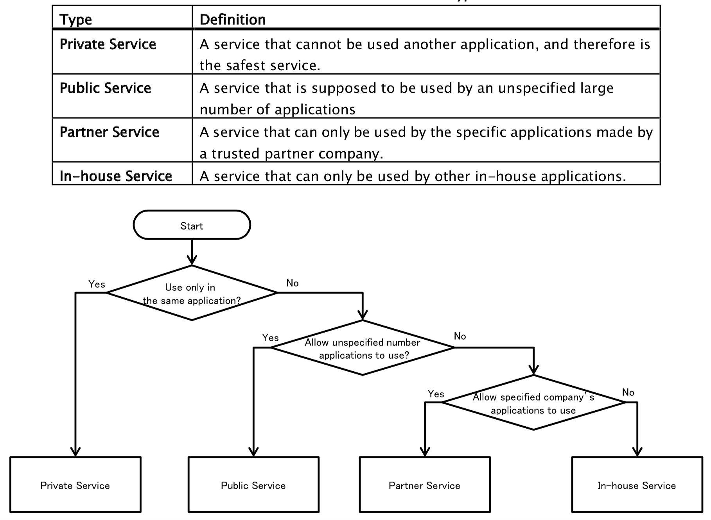
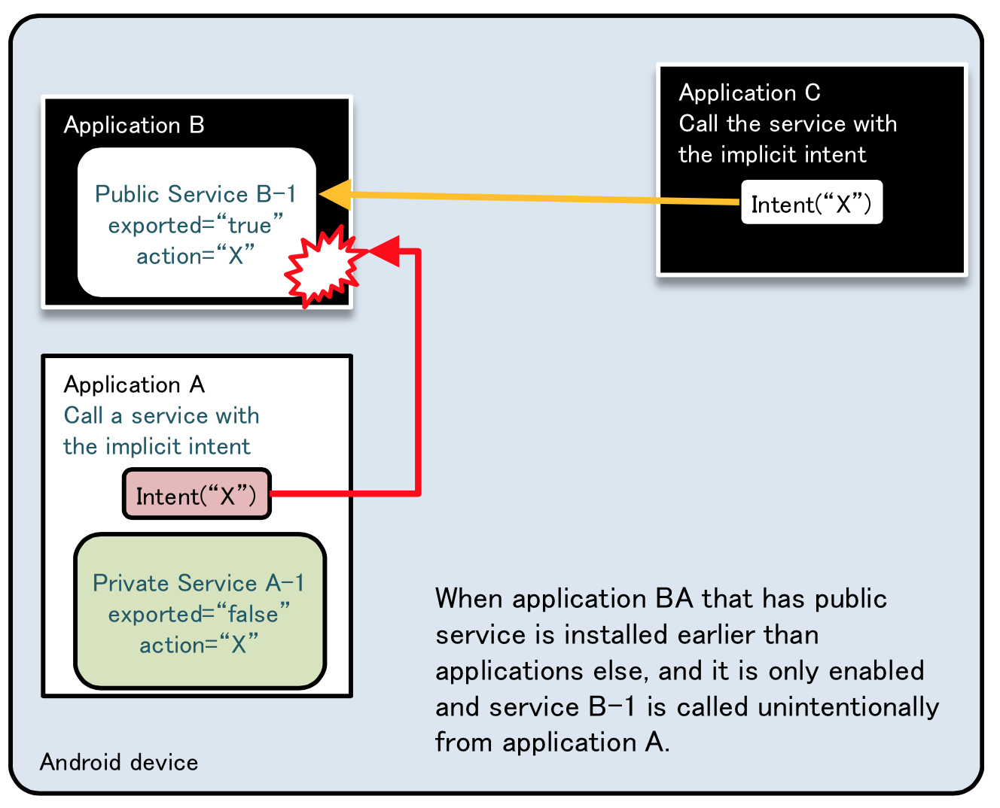

# Android Service Security 

**Author:瘦蛟舞**

**Create:20141218**

---

## 0x00 科普

---

一个Service是没有界面且能长时间运行于后台的应用组件．其它应用的组件可以启动一个服务运行于后台,即使用户切换到另一个应用也会继续运行．另外,一个组件可以绑定到一个service来进行交互,即使这个交互是进程间通讯也没问题．例如,一个service可能处理网络事物,播放音乐,执行文件I/O,或与一个ContentProvider交互,所有这些都在后台进行．

## 0x01  知识要点

---

**生命周期**


左图是startService()启动service,右图是bindService()绑定service.

startService与bindService都可以启动Service,那么它们之间有什么区别呢？它们两者的区别就是使Service的周期改变.由startService启动的Service必须要有stopService来结束Service,不调用stopService则会造成Activity结束了而Service还运行着.bindService启动的Service可以由unbindService来结束,也可以在Activity结束之后(onDestroy)自动结束.

**关键方法**


- onStartCommand()
系统在其它组件比如activity通过调用startService()请求service启动时调用这个方法．一旦这个方法执行,service就启动并且在后台长期运行．如果你实现了它,你需要负责在service完成任务时停止它,通过调用stopSelf()或stopService()．(如果你只想提供绑定服务,你不需实现此方法)．

- OnBind()
当组件调用bindService()想要绑定到service时(比如想要执行进程间通讯)系统调用此方法．在你的实现中,你必须提供一个返回一个IBinder来以使客户端能够使用它与service通讯,你必须总是实现这个方法,但是如果你不允许绑定,那么你应返回null．

- OnCreate()
系统在service第一次创建时执行此方法,来执行只运行一次的初始化工作(在调用它方法如onStartCommand()或onBind()之前)．如果service已经运行,这个方法不会被调用．

- OnDestroy()
系统在service不再被使用并要销毁时调用此方法．你的service应在此方法中释放资源,比如线程,已注册的侦听器,接收器等等．这是service收到的最后一个调用．

- public abstract boolean bindService (Intent service, ServiceConnection conn, int flags)

	BindService中使用bindService()方法来绑定服务,调用者和绑定者绑在一起,调用者一旦(all)退出服务也就终止了.

- startService()

	startService()方法会立即返回然后Android系统调用service的onStartCommand()方法．但是如果service尚没有运行,系统会先调用onCreate(),然后调用onStartCommand().

- protected abstract void onHandleIntent (Intent intent)

	调用工作线程处理请求

- public boolean onUnbind (Intent intent)

	当所有client均从service发布的接口断开的时候被调用.默认实现不执行任何操作,并返回false.


**extends**

1. Service

	这是所有service的基类．当你继承这个类时,在service中创建一个新的线程来做所有的工作是十分重要的．因为这个service会默认使用你的应用的主线程(UI线程),这将拉低你的应用中所有运行的activity的性能.

2. IntentService

	这是一个Service的子类,使用一个工作线程来处理所有的启动请求,一次处理一个．当你不需service同时处理多个请求时的最佳选择．你要做的就只是实现onHandleIntent(),这个方法接收每次启动请求发来的intent之后用于后台处理.


**表现形式**

1. Started

	一个service在某个应用组件（比如一个activity)调用startService()时就处于"started"状态（注意,可能已经启动了）．一旦运行后,service可以在后台无限期地运行,即使启动它的组件销毁了．通常一个started service执行一个单一的操作并且不会返回给调用者结果．例如,它可能通过网络下载或上传一个文件．当操作完成后,service自己就停止了

2. Bound

	一个service在某个应用组件调用bindService()时就处于"bound"状态．一个boundservice提供一个client-server接口以使组件可以与service交互,发送请求,获取结果,甚至通过进程间通讯进行交叉进行这些交互．一个boundservice仅在有其它应用的组件绑定它时运行．多个应用组件可以同时绑定到一个service,但是当所有的自由竞争组件不再绑定时,service就销毁了．

**Bound Service**


当创建一个提供bound service时,你必须提供一个client用来与service交互的IBinder．有三种方式你可以定义这个接口：

1. 继承Binder

	不需要跨进程通信的时候建议使用这种方法.

google给的example

```java
public class LocalService extends Service {
    // Binder given to clients
    private final IBinder mBinder = new LocalBinder();
    // Random number generator
    private final Random mGenerator = new Random();

    /**
     * Class used for the client Binder.  Because we know this service always
     * runs in the same process as its clients, we don't need to deal with IPC.
     */
    public class LocalBinder extends Binder {
        LocalService getService() {
            // Return this instance of LocalService so clients can call public methods
            return LocalService.this;
        }
    }

    @Override
    public IBinder onBind(Intent intent) {
        return mBinder;
    }

    /** method for clients */
    public int getRandomNumber() {
      return mGenerator.nextInt(100);
    }
}
```

2. 使用一个Messenger

	Messenger的核心其实就是Message以及Handler来进行线程间的通信.并未像继续binder那样直接调用Service的方法而是通过Message来交互.
	
	service创建一个带有Messager的接口,再定义一个Handler来负责不同类型的Message对象.
	
	这个Handler是Messenger可以与客户端共享一个IBinder的基础,它允许客户端使用Message对象发送命令给service.客户端可以定义一个自己的Messenger以使service可以回发消息.

	这是实现PC的最简单的方法(本质还是AIDL),因为Messenger把所有的请求都放在队列中依次送入一个线程中,所以不用service考虑线程安全问题.
	

3. 使用AIDL

	AIDL(Android Interface Definition Language,Android接口定义语言).IDL语言,用于生产IPC代码,削弱重复造轮子的苦恼.
	
	上面所讲的使用一个Messenger实际上就是基于AIDL的.Messenger在一个线程中创建一个容纳所有客户端请求的队列,使用service一个时刻只接收一个请求.
	
	然而如果你想要你的service同时处理多个请求,这个时候就需要直接使用AIDL.这种情况下你需要自己确保线程安全.

	要直接使用AIDL,你必须创建一个.aidl文件,它定义了程序的接口．AndroidSDK工具使用这个文件来生成一个实现接口和处理IPC的抽象类,之后你在你的service内继承它．


**注意**


如果你打算只在本应用内使用自己的service,那么不需指定任何intent filter．不使用intent filter则必须使用一个显示service的intent来启动service．


另外也可以通过包含android:exported属性,并指定其值为“false”来保证service是私有的．即使你的service使用了intent filter也会生效．


当一个service被启动后,它的生命期就不再依赖于启动它的组件并且可以独立运行于后台,即使启动它的组件死翘翘了．所以service应该工作完成后调用stopSelf()自己停止掉,或者其它组件也可以调用stopService()停止service．

如果service没有提供绑定功能,传给startService()的intent是应用组件与service之间唯一的通讯方式．然而如果你希望service返回一个结果,那么启动这个service的client可以创建一个用于广播(使用getBroadcast())的PendingIntent然后放在intent中传给service,service然后就可以使用广播来回送结果．

## 0x02 安全建议

**service分类**



* 私有service:不能被其他应用调用,相对安全
* 公开service:可以被任意应用调用
* 合作service:只能被信任合作公司的应用调用
* 内部service:只能被内部应用调用


**intent-filter与exported组合建议**


总结:

* exported属性明确定义
* 私有service不定义intent-filter并且设置exported为false
* 公开的service设置exported为true,intent-filter可以定义或者不定义
* 内部/合作service设置exported为true,intent-filter不定义

**rule book**

1. 只被应用本身使用的service应设置为私有

2. service接收到的数据需需谨慎处理

3. 内部service需使用签名级别的protectionLevel来判断是否未内部应用调用

4. 不应在service创建(onCreate方法被调用)的时候决定是否提供服务,应在onStartCommand/onBind/onHandleIntent等方法被调用的时候做判断.

5. 当service又返回数据的时候,因判断数据接收app是否又信息泄露的风险

6. 有明确的服务需调用时使用显示意图

7. 尽量不发送敏感信息

8. 合作service需对合作公司的app签名做效验


## 0x03 测试方法

1. service只能静态注册,通过反编译查看配置文件Androidmanifest.xml即可确定service,若有导出的service则进行下一步

2. 方法查看service类,重点关注onCreate/onStarCommand/onHandleIntent/onBind方法

3. 检索所有类中startService/bindService方法及其传递的数据

4. 根据业务情况编写测试poc或者直接使用adb命令测试

**逆向随笔update**

startService就是简单的send intent不必多讲,单独在说说bound service attack.

Messenger的Service结合drozer可以快速poc或者fuzz.

AIDL的service如果能拿到源码中的AIDL文件是很容易处理的,但是大多数情况下是没有的.这时候如果能有一个client的apk也可以直接反编译后拷贝其调用代码.若还是没有则可以自己代理类.

更为详细的演示可参考[Android Bound Service攻击 - 小荷才露尖尖角](http://www.vuln.cn/6033)

## 0x04 案例

---

**案例1：权限提升**

* [WooYun: 乐phone手机任意软件包安装删除漏洞](http://wooyun.github.io/bugs/wooyun-2010-0509)
* [WooYun: 红米手机金山清理大师应用内存清理权限泄露漏洞](http://wooyun.github.io/bugs/wooyun-2010-048025)
* [WooYun: 猎豹清理大师内存清理权限泄露漏洞](http://wooyun.github.io/bugs/wooyun-2010-048735)


**案例2:services劫持**

攻击原理:隐式启动services,当存在同名services,先安装应用的services优先级高

攻击模型




**案例3:拒绝服务**


* [WooYun: 雪球Android客户端空指针异常及信息泄露漏洞](http://wooyun.github.io/bugs/wooyun-2010-048028) (java.lang.NullPointerException 空指针异常)


现在除了空指针异常crash外还多出了一类crash:intent传入对象的时候,转化出现异常.


Serializable:


	Intent i = getIntent();         					if(i.getAction().equals("serializable_action"))
		{  
			i.getSerializableExtra("serializable_key");//未做异常判断
		}
		
Parcelable:

	this.b =(RouterConfig)  this.getIntent().getParcelableExtra("filed_router_config");//引发转型异常崩溃

针对此攻击建议做个全局的错误捕捉,参考代码如下

https://github.com/WooyunDota/UsefulUtils/blob/master/security/SafeIntent.java

POC内传入畸形数据即可引发crash,修复很简单捕获异常即可.

**案例4:消息伪造**


* [WooYun: 优酷Android 4.5客户端升级漏洞](http://wooyun.github.io/bugs/wooyun-2015-094635)


## 0x05 参考

---

[http://blog.csdn.net/niu_gao/article/details/7307462](http://blog.csdn.net/niu_gao/article/details/7307462)

[http://developer.android.com/reference/android/app/Service.html](http://developer.android.com/reference/android/app/Service.html)

[http://developer.android.com/guide/components/services.html](http://developer.android.com/guide/components/services.html )


