# AndroidAccessibility点击劫持攻防

---

**Author:瘦蛟舞**

**Create:20170814**

关键词: Accessibility模拟点击 Activity权限验证 

[[toc]]

---

### 0x00 快手互粉劫持事件

此文章源于一起Accessibility模拟点击劫持.

补刀小视频和快手互为竞品应用,目标群体类似.而快手用户量级明显多于补刀.快手很多用户有互粉需求,于是补刀小视频开发了快手互粉助手来吸引快手用户安装.互粉助手这个功能主要是利用Accessibility.

之前接触Android辅助功能AccessibilityService模拟点击都是用于诸如应用市场的免root自动安装功能或者红包助手自动抢红包功能,另外还有一些恶意软件会使用这个特性.

此次用于劫持其他App达到推广自身的目的倒是令人感到好奇于是分析了一下写出此文.供以后有类似场景需求的做参考.

劫持男猪脚补刀小视频利用Android模拟点击的接口做了一个快手互粉的功能,下面先分析一下补刀APP是如何完成此功能的.

互粉功能入口com.yy.budao/.ui.tools.AddFansWebActivity


AccessbilityService辅助功能的授权需要用户手动去完成.(通过一些Android系统漏洞可以绕过此步骤)

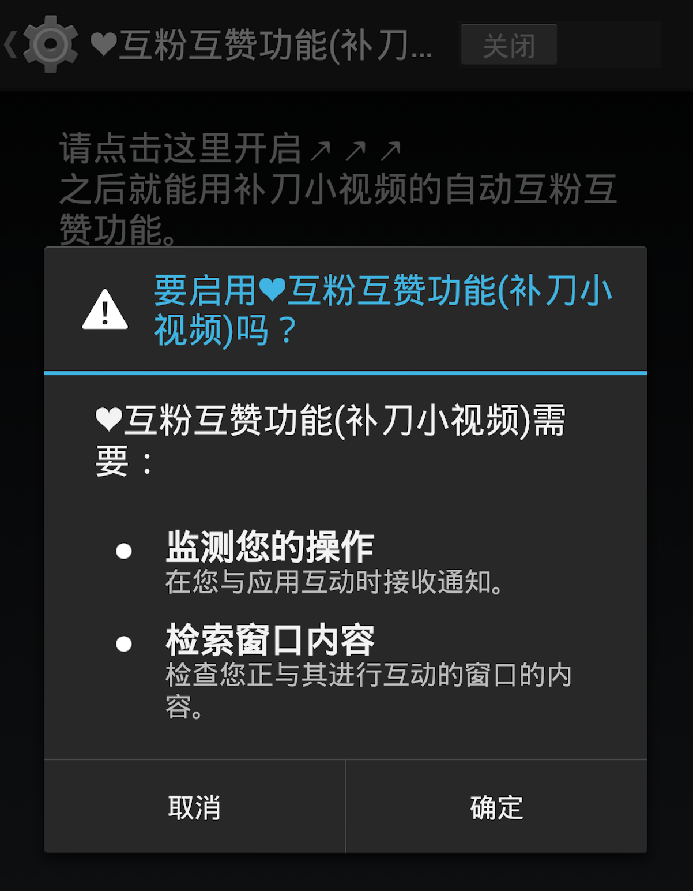

通过快手的scheme伪协议kwai://profile/uid启动到需要互粉用户的个人界面

```
08-14 10:29:03.869 893-3614/? I/ActivityManager: START u0 {act=android.intent.action.VIEW dat=kwai://profile/18070291 pkg=com.smile.gifmaker cmp=com.smile.gifmaker/com.yxcorp.gifshow.activity.ProfileActivity} from pid 1198

08-14 10:29:03.989 893-917/? I/ActivityManager: Displayed com.smile.gifmaker/com.yxcorp.gifshow.activity.ProfileActivity: +106ms

adb手动验证一下adb shell am start -n com.smile.gifmaker/com.yxcorp.gifshow.activity.ProfileActivity -d kwai://profile/18070291
```

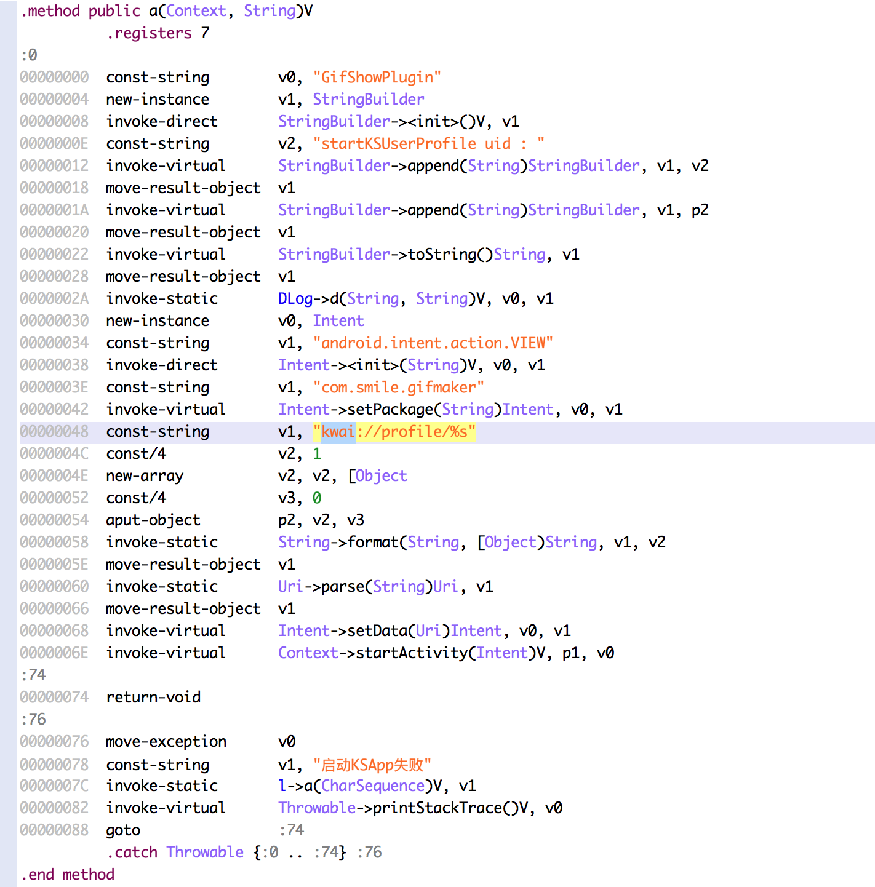

最后由辅助功能完成模拟点击关注

补刀APP对快手APP的Activity和VIEW相关信息提取

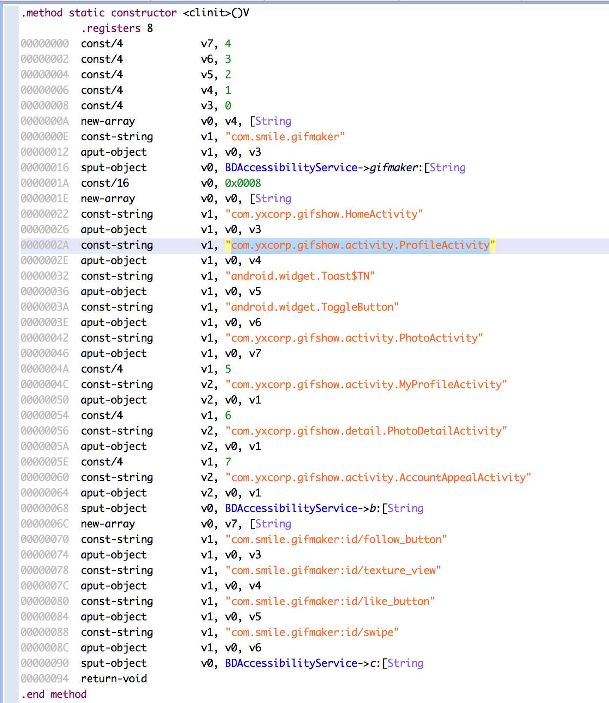

0x0010即是辅助功能的点击事件AccessibilityAction#ACTION_CLICK

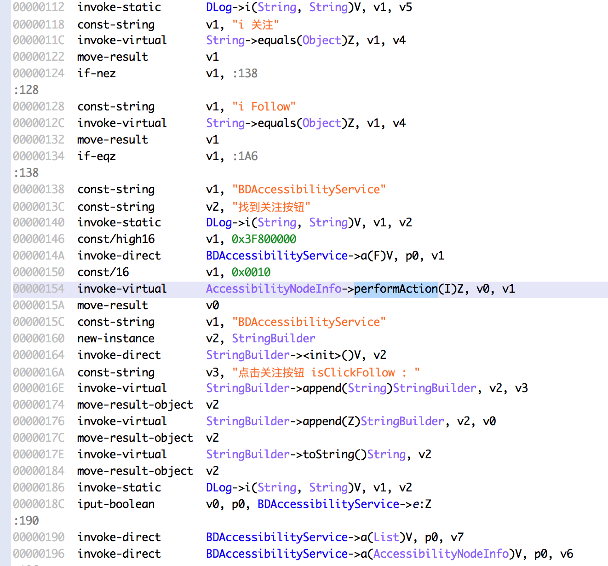

快手个人信息展示页ProfileActivity中的View.

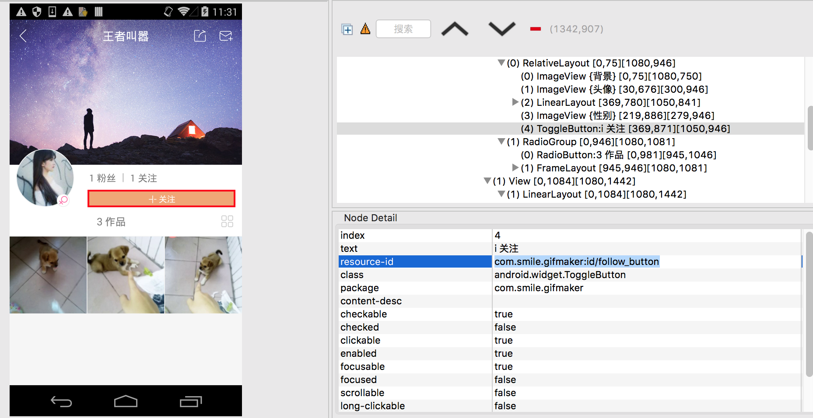

APP遇到这种劫持通常想到的解决方法有两种选择:

* 不导出被劫持启动的Activity,但是快手这里确实需要导出给正常APP如微信打开以提升用户体验.

* 通过申明permission保护Activity,但是如果级别为dangerous劫持者同样可以申明此permission,级别为signature又与微信签名不同不能实现.

下图为微信分享的快手个人主页JS


所以现在有两个防御思路三个方案来解决此问题.

* 阻止辅助功能模拟点击
	- 方案零:重写View类的performAccessibilityAction方法或者设置AccessibilityDelegate,过滤掉AccessibilityNodeInfo.ACTION_CLICK 和 AccessibilityNodeInfo.ACTION_LONG_CLICK等事件.如果不考虑视觉障碍用户可以过滤掉全部AccessibilityNodeInfo事件来完全禁止AccessibilityService对app内view的管控.

* 阻止补刀小视频启动快手导出的ProfileActivity.也就是进行Activity发起方的身份认证.
	- 方案一:Referrer检测,通过反射拿到mReferrer即调用方包名再验证签名.
	- 方案二:Service中转,通过bindService的导出方法拿到调用方uid,再通过uid获取待验证的包名和签名.

从安全性来看方案二较好,就快手此例的业务切合度来看结合方案零和方案一比较合理.

### 0x01 方案零:重写performAccessibilityAction

方案利弊:

* 兼容全版本android手机(泛指API14+)

* 不需要正常Activity调用方(比如微信微博浏览器)做改动

* 有被绕过可能,劫持者只需要单独将点击事件剔除整个自动互粉流程,让点击关注由用户完成即可.补刀APP主要负责启动快手个人用户界面ProfileActivity以及监控关注动作是否完成.

重写performAccessibilityAction方法,忽略AccessibilityService传来的事件.让模拟点击失效.

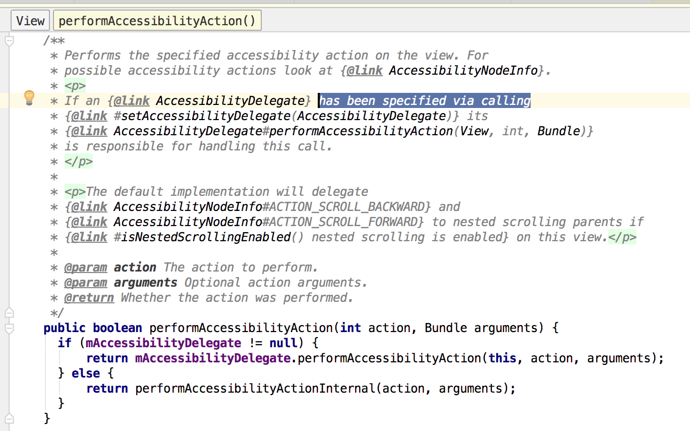

1.  重写View类代码

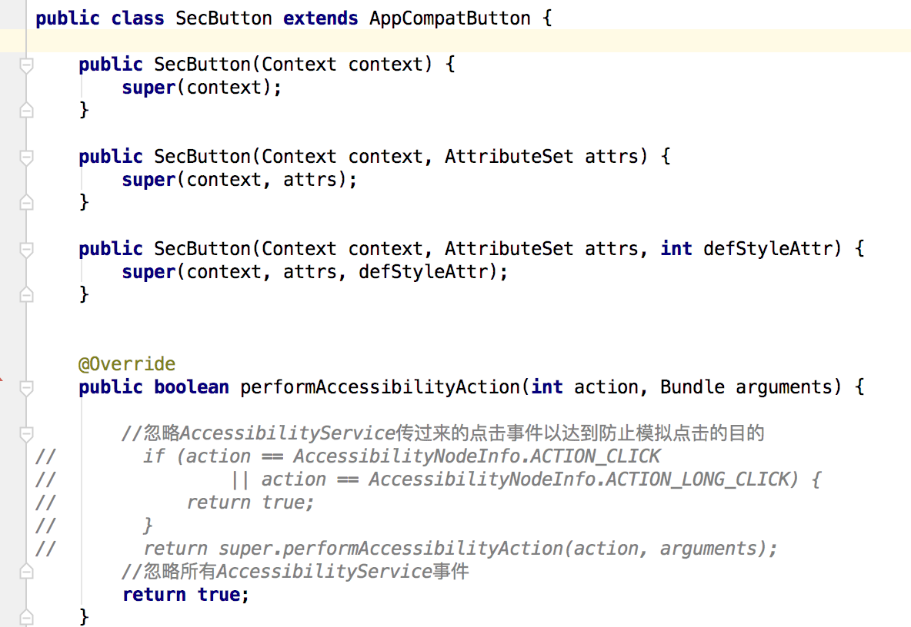

2.为View设置AccessibilityDelegate

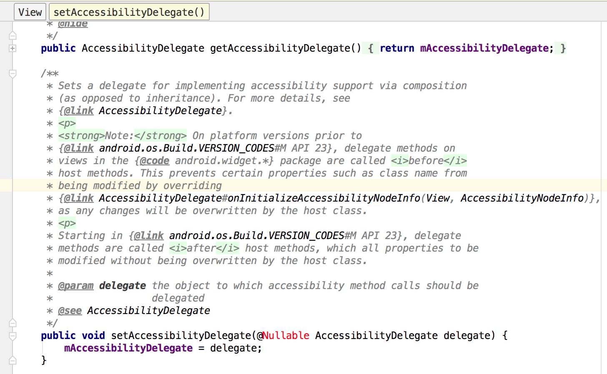

example

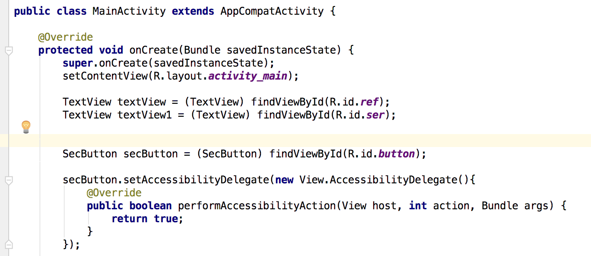

### 0x02 方案一:Referrer检测

方案利弊:

*   仅支持android5.1以及更高版本android手机.

*   不需要Activity正常调用方做改动.

*   可以绕过,Referrer本质不可信.

    *   通过反射或者 hook 操作自身进程内的 ContextWrapper / ContextImpl关于packageName的Method和Field.

    *   劫持者可以结合Accessbility 或者 URL scheme通过浏览器中转一次,从而以浏览器的Referrer启动ProfileActivity.

送分姿势1:getCallingPackage()

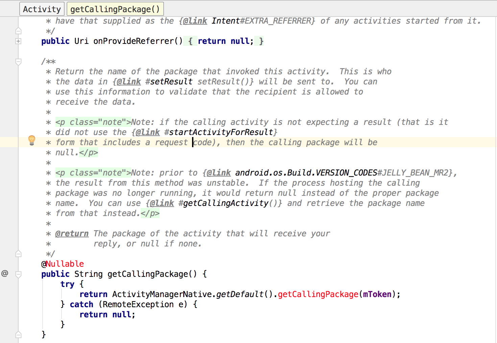

Activity自带的getCallingPackage()是可以获取调用方包名的,但是此法只限调用方执行的是startActivityForResult(),如果执行的是startActivity()得到的结果将是null.

这里无法限制调用方执行何种方法,所以行不通.

送分姿势2:getReferrer()

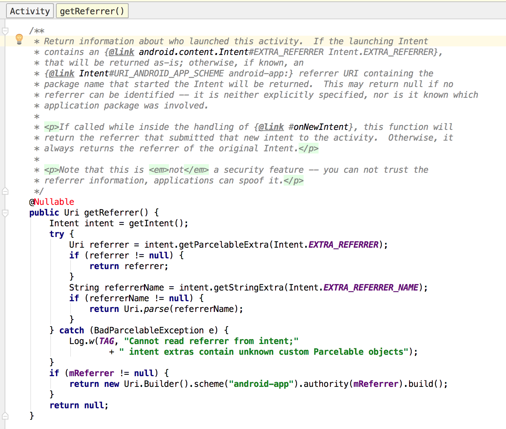

上图getReferrer()有三个return Referrer的调用,谷歌确把相对可靠一点的放在最后,应该是为了更高的可用性..

API 22也就是Android 5.1开始支持getReferrer()方法,通过getReferrer()得到的uri即是调用者的身份.但是前提是调用方没有使用

```java
intent.putExtra(Intent.EXTRA_REFERRER,Uri.parse("android-app://mi.bbbbbbbb"));

intent.putExtra(Intent.EXTRA_REFERRER_NAME, "android-app://mi.ccccccc");

@Override

public Uri onProvideReferrer() {

   super.onProvideReferrer();

   Uri uri = Uri.parse("android-app://mi.aaaaaaaaa");

   return uri;

}
```

也就是说getReferrer()得到的值是可以被伪造的不是安全可靠的功能不可信,谷歌API里也提示了这点.

从代码中看来getReferrer()本质也是intent操作,只不过由系统隐藏完成.所以调用再次执行putExtra操作即可覆盖之前EXTRA_REFERRER_NAME.

送分姿势3:通过反射拿到Field mReferrer

此法解决了前面提到的Referrer被伪造的问题,但是并不能解决Referrer不可信的本质.

关键代码如下

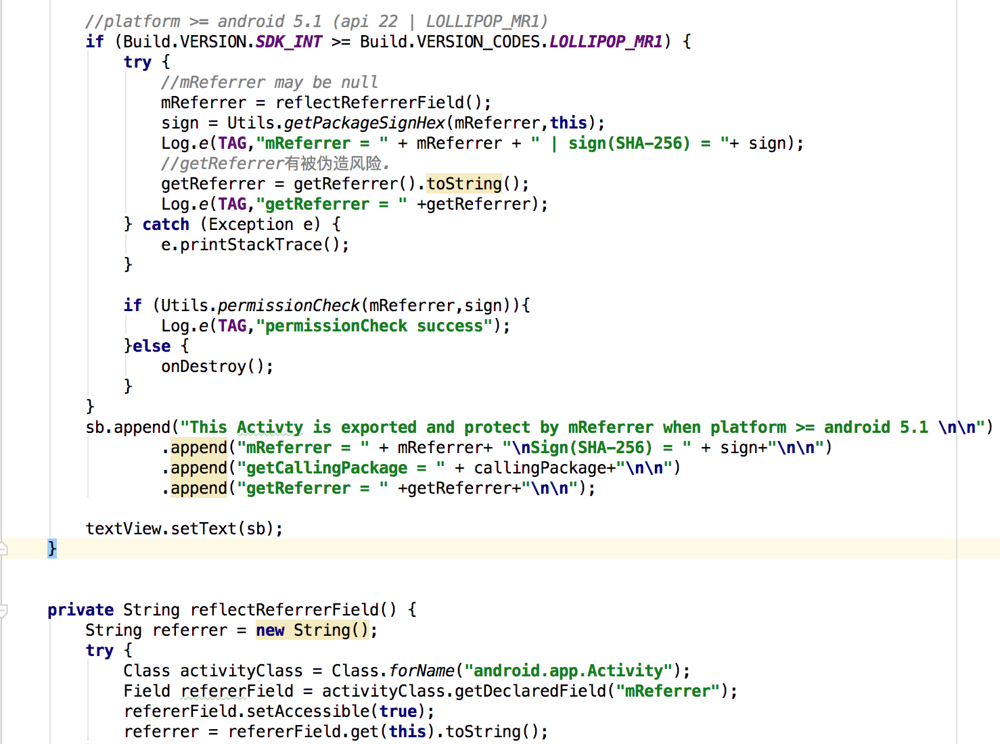

demo app 效果如下

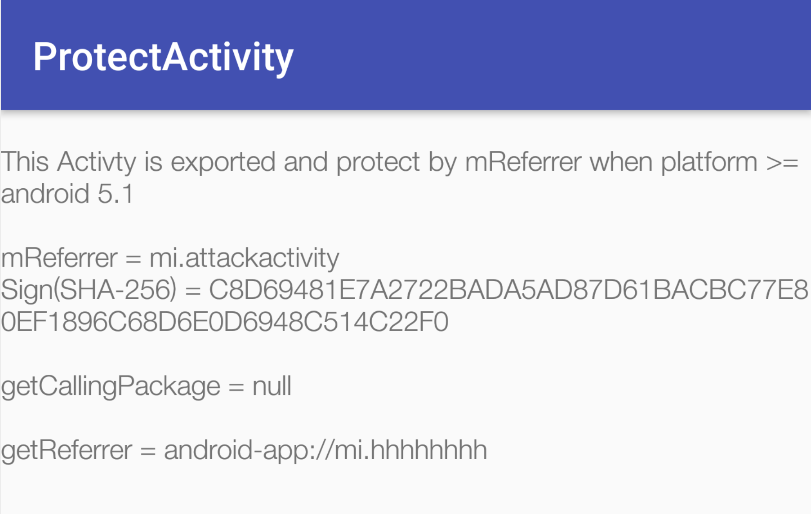

mReferrer赋值依赖调起方传入的参数,所以也是能伪造的,只是伪造相对前两种姿势要麻烦一点.通过反射或者 hook 操作自身进程内的 ContextWrapper / ContextImpl 关于packageName的Method和Field.

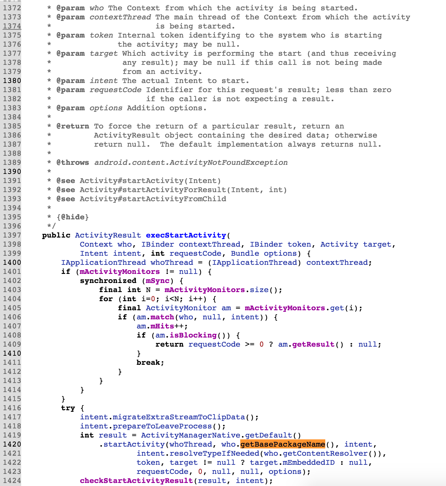

### 0x03 方案二:Service中转

方案利弊:

*   支持全版本android手机

*   安全性较好,难被绕过

*   需要Activity正常调用方做改动,由startActivity改为bindService

因为Intent并不直接携带身份信息,所以无法通过startActivity所传的Intent直接验证调用方身份.而Bound service可以通过Binder的getCallingUid得知调用方uid,再通过PMS拿到uid对应的包名和应用签名.所以可以通过service中转一下完成身份认证这个需求,将Activity不导出转而导出Sevice,再service中完成包名和签名的黑白名单验证后再决定是否启动相关Activity.即完成了身份验证.

关键代码如下

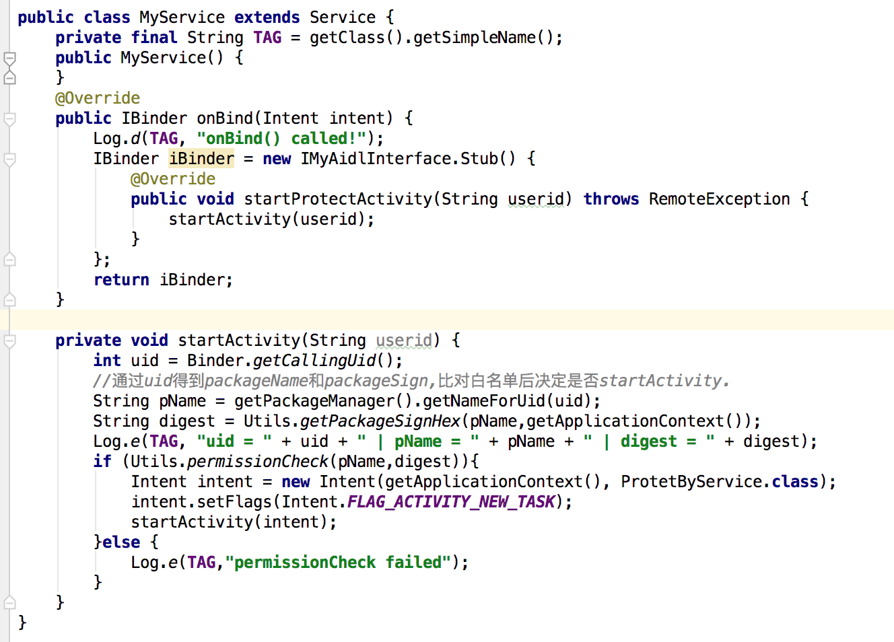

### 0x04 demo代码

https://github.com/WooyunDota/StartActivityCheck

### 0x05 延展攻击Android手机

Accessibility既然可以用来攻击竞品APP,那么攻击Android手机也可以的,这里以某手机本地备份举例.

某手机可以本地备份的数据有:

*   通讯录

*   多媒体数据

    *   相机照片

    *   相机视频

*   录音

*   应用及数据

    *   微信

    *   微博

    *   .....

*   系统数据

    *   短信记录

    *   通话记录

    *   日历日程

    *   备忘录

    *   闹钟

    *   WIFI密码

    *   浏览器数钱

    *   ....

这就意味着我们通过Accessbility模拟点击窃取备份文件的话就可以得到以上数据.

如果不慎中招意味着几乎将手机上所有数据拱手送人.

攻击流程:

1.  检测/sdcard/HuaweiBackup/backupFiles是否有用户自己完成的历史无加密备份可用(另外一个目录backupFiles1为加密备份).

2.  诱导用户获取Accessbility权限,从快手互粉/自动抢红包/免root安装这些需求来看这个攻击条件达成的难度并不高.

    -  可以利用overlay攻击(CVE-2017-0752)来获取Accessbility权限.

    -  也可以利用比如"某手机wifi密码查看器"这类功能引诱用户开启权限.

4.  检测空闲,检测屏幕状态,采集陀螺仪/加速度传感器.减少用户对模拟点击的感知.

5.  利用辅助功能模拟点击完成无加密备份.开始备份后切换到后台减少感知.

6.  从sdcard中窃取无加密的备份数据.

攻击场景分两种:

1.恶意应用,获取机主隐私数据,比如wifi密码,通信录,短信等数据.对应无设备锁检测的app甚至可以直接利用其备份数据登录app.对于有设备检测的app则需要进一步绕过利用,比如微信的聊天记录需要单独再次解密.

2.接触手机,绕过如沙箱保护/应用锁等限制获取数据.比如拿到其公司wifi密码登录内网.

做几个demo

1.  查看wifi密码

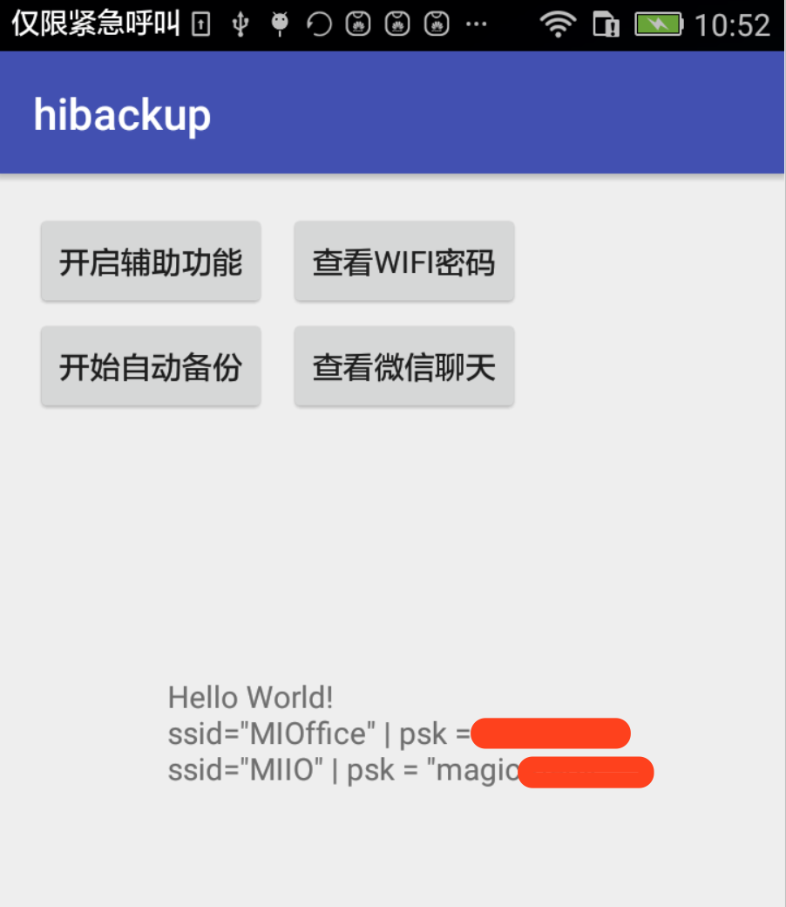

2.以微信数据为例,恶意APP可以通过此方式突破沙箱限制获取微信内的数据.接触手机的人也可以绕过应用锁查看微信聊天记录

微信的聊天记录存储在EnMicroMsg.db中

加密的秘钥为(手机IMEI + 微信uin)取MD5的前7位小写.

某手机存储备份文件的方式,记录文件路径和File_index索引


再将索引对应的大文件进行拆分存储.

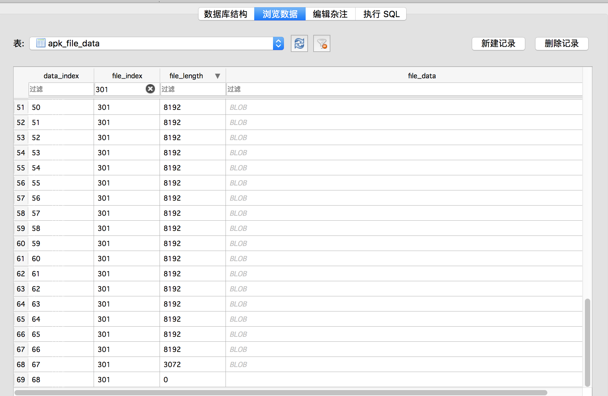

根据file_index拼接处完整EnMicroMsg.db. 在从shared_prefs中检索出uin得到db的解密秘钥.即可查看聊天记录.

获取IMEI的文件,从shared_prefs中拿IMEI有两个好处1.不用考虑双卡问题,2.不用申请READ_PHONE_STATE权限.


demoGIF

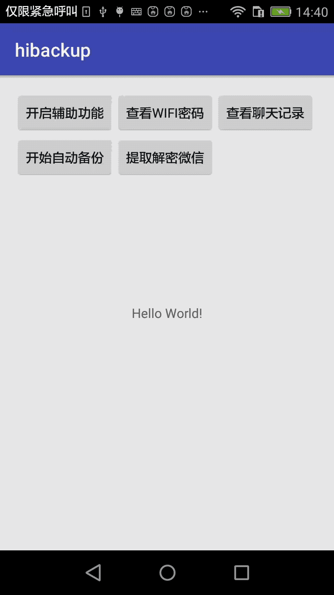

以上问题均已提前告知相关厂商,厂商回复以及相关进度如下:

2017-09-11 通知PSIRT

2017-12-13 [致谢修复漏洞](http://www.huawei.com/cn/psirt/security-advisories/huawei-sa-20171213-05-smartphone-cn)

### 0x06 参考

https://stackoverflow.com/questions/15723797/android-prevent-talkback-from-announcing-textview-title-aloud

https://stackoverflow.com/questions/5383401/android-inject-events-permission

http://blog.csdn.net/alan480/article/details/52223920

http://blog.csdn.net/u013553529/article/details/53856800

http://www.jianshu.com/p/ea38d4370703
